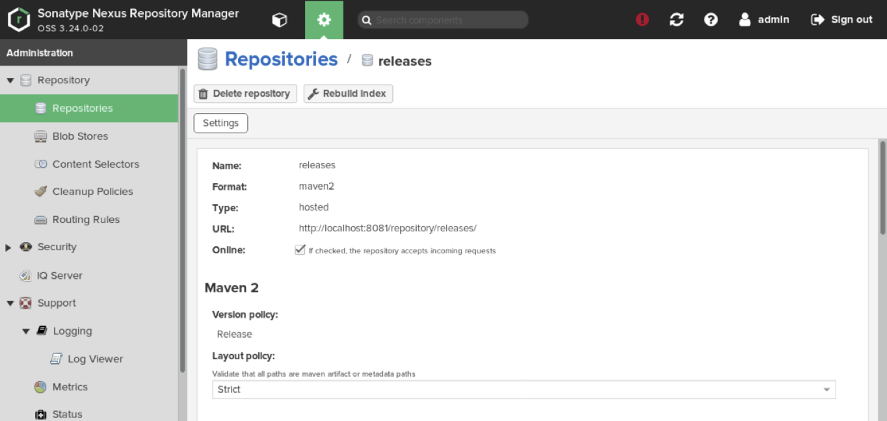
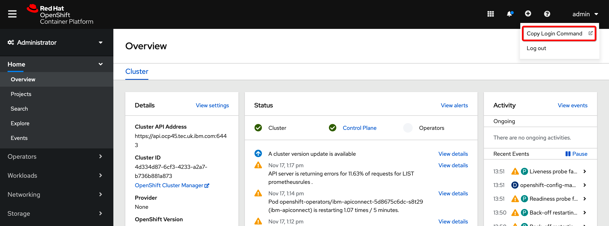
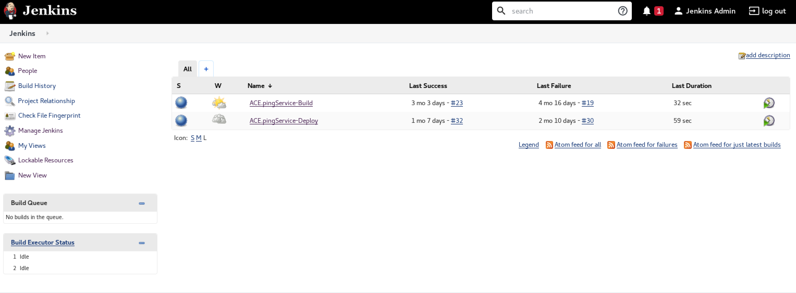
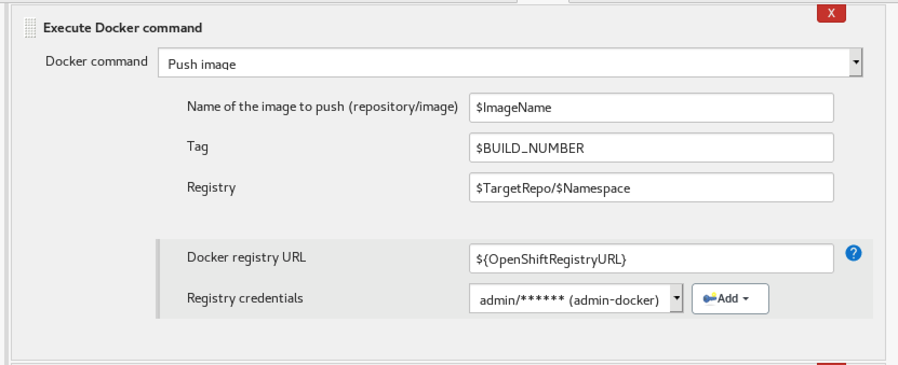

# IBM ACE CI/CD with Jenkins

>**IMPORTANT NOTE:** This document is based on the version CP4I 2020.3.1. From version 2021.2.1 on, it is possible to use an external repository for the bar files and therefore to avoid creating custom images and simplify the procedure.
Please see the following example: [ACE_Tekton_Operators](https://github.com/isalkovic/ACE_Tekton_Operators)
---

**Table of contents**

- [Introduction](#introduction)
- [Demo scenario](#demo-scenario)
- [Nexus setup](#nexus-setup)
- [Jenkins setup](#jenkins-setup)
- [Jenkins projects](#jenkins-projects)
  - [The ACE.pingService-Build project steps](#ace-build)
  - [The ACE.pingService-Deploy project steps](#ace-deploy)
  - [Running the Jenkins project](#running-project)
- [Recommended reading](#recommended-reading)


&nbsp;

<a name="introduction"></a>

## Introduction

This document shows an example of the CI/CD solution combining Jenkins, GitHub, and Nexus. It is based on the IBM Developer Recipe 

https://developer.ibm.com/recipes/tutorials/building-cicd-piepeline-for-ibm-app-connect-enterprise-on-cloud-pak-for-integration/

adapted for using OpenShift Operators instead of the Helm Charts as was shown in the original document.  

In the described scenario, Jenkins and Nexus were installed on a separate machine with Centos 7 64-bit operating system, but they can also be installed on the same OpenShift cluster as the Cloud Pak. 

Please see the above link for the details about Jenkins and Nexus installation steps.

The target environment was Cloud Pak for Integration v2020.3.1 running in the OpenShift v4.5 cluster in IBM Cloud (ROKS). 

The ACE Toolkit was running on the same Centos machine as Jenkins and Nexus. It a real-life situation it would be, of course, running on the developer's workstation. 

The following document gives instruction on how to integrate ACE Toolkit with GitHub: 

https://github.ibm.com/srecko-janjic/CP4I-ACE-CI-CD-Toolkit-setup

it includes the instructions for establishing ssh access to the GitHub repository. The ssh connection is used in this scenario not only for accessing GitHub from Toolkit but also for the communication between Jenkins and GitHub. 


&nbsp;

<a name="demo-scenario"></a>

## Demo scenario


The demo includes the following steps
- The process is initiated by pushing the content of the ACE Toolkit workspace to the GitHub repo
- Jenkins pulls the content from GitHub and builds the BAR file using the local ACE installation. It stores the file to the Nexus repo.
- Another Jenkins pipeline pulls the BAR from Nexus, builds the Docker image, tags it, and pushes it to the OpenShift registry. The same pipeline takes this image to create an Integration Server instance in the Cloud Pak running in the same OpenShift cluster.


&nbsp;

<a name="nexus-setup"></a>

## Nexus setup

The Nexus is used in this scenario as an itermediate repository for holding BAR files. 

Please see the *Step 2* of the [Developer Recipe](https://developer.ibm.com/recipes/tutorials/building-cicd-piepeline-for-ibm-app-connect-enterprise-on-cloud-pak-for-integration/) for the instructions about Nexus installation and configuration. 

We created a Maven2 format repository called **releases**
The repository URL was http://localhost:8081/repository/releases





&nbsp;

<a name="jenkins-setup"></a>

## Jenkins setup

Please see the *Step 2* of the [Developer Recipe](https://developer.ibm.com/recipes/tutorials/building-cicd-piepeline-for-ibm-app-connect-enterprise-on-cloud-pak-for-integration/) for the instructions about Nexus installation and configuration.
 
According to the instructions we configured credentials for accessing GitHub (credential ID **jenkins-github**), Nexus (credential ID **admin-nexus**) and OpenShift registry (**admin-docker**)


We found that the configuration of the OpenShift credentials is a bit problematic because the OpenShift token regularly expires and has to be replaced. This is probably one of the reasons why it would be better to run Jenkins as a pod in the OpenShift cluster rather than on a separate server. 

Those are the steps for replacing the OpenShift token:

- Login to the OpenShift web console, click on the username and select **Copy Login Command**
  

- Copy the command displayed on the page:
  

- Go to the terminal window on the Jenkins server and run the login command (the prerequisite for the setup was that the *oc* CLI is installed on the Jenkins serve):  
  !Login](images/Snip20201117_32.png)

- Display the token with `oc whoami -t` command and copy it
  

- Open Jenkins web console and select **Manage Jenkins**:
  

- Select **Manage Credentials**
  

- Select OpenShift credentials from the list. In our example the credentials name was *admin-docker*: 
  

- Click on **Change Password** button:
  !Change Password](images/Snip20201117_29.png)

- Paste token to the password field
  


&nbsp;

<a name="jenkins-projects"></a>

## Jenkins projects

The “Freestyle” project type was used in our scenario. This is the simplest Jenkins project type.


1. **ACE.pingService-Build** fetches ACE project artifacts from the GitHub repository, builds a BAR file using the ACE runtime installed locally on the same server, and finally stores BAR as a new build in the Nexus *releases* repository.
2. **ACE.pingService-Deploy** takes the BAR from the Nexus repository, retrieves the Dockerfile from the GitHub repository, build a Docker image, tags the image for the remote OpenShift image repository, pushes the image to the OpenShift repository, and finally creates a new instance of the Integration Server custom resource by providing the YAML definition to the ACE operator on OpenShift. 




<a name="ace-build"></a>

### The ACE.pingService-Build project steps

- Select the Build project
  

- Configure the project
  

- Fetching the artifacts from GitHub
  

- Build environment settings
  

- Building the BAR file
  

- Storing BAR file to the Nexus repository
  
  


<a name="ace-deploy"></a>

### The ACE.pingService-Deploy project steps

- Select the Deploy project
  )

- Configure the project
  

- Setting up the project parameters

  * Build version (that we take from the Nexus repository)
    

  * The name of a Docker image that will be created
    

  * OpenShift registry URL
    

  * Target repository name
    

  * OpenShift namespace
    

  * Integration Server release name
    

  * Integration Server replica count
    

- Fetching the Dockerfile from GitHub
  

- Build environments
  

- Clearing the existing workspace 
  

- Getting the BAR from the Nexus repository
  
  

- Unzipping artifacts downloaded from Nexus
  

- Building the Docker image
  

- Tagging the Docker image
  

- Pushing the Docker image
    

- Deploying the integration server
  


Here is the deploying command once again:

```
#!/bin/sh
oc login --token=rb7Lhe-HPOChyVK8pmW6_OaNOF1pDvgKzeg8jcMcFF4 --server=https://c100-e.eu-de.containers.cloud.ibm.com:30454
cat << EOF | oc apply -f -
apiVersion: appconnect.ibm.com/v1beta1
kind: IntegrationServer
metadata:
  name: ${ReleaseName}
  namespace: ${Namespace}
spec:
  pod:
    containers:
      runtime:
        image: image-registry.openshift-image-registry.svc:5000/${Namespace}/${ImageName}:$BUILD_NUMBER
  configurations: []
  designerFlowsOperationMode: disabled
  license:
    accept: true
    license: L-AMYG-BQ2E4U
    use: CloudPakForIntegrationNonProduction
  replicas: ${ReplicaCount}
  router:
    timeout: 120s
  service:
    endpointType: http
  useCommonServices: true
  version: 11.0.0
EOF
```

As you can see, we login to the OpenShift cluster and run `oc apply` command with the YAML structure.
**Please note** that we need an OpenShift token to log in. This means that we need to **update** this command as well when the **token expires**. 

Please also note the difference in this YAML comparing to the YAML when we deploy an instance of the Integration Server using the ACE Dashboard. In this case, we refer to the Docker image that we build instead of the uploaded BAR file. 

<a name="running-project"></a>

### Running the Jenkins project

- Open the project and click on **Build now** (if the project has parameters defined it is possible to change/set their values at this point)
  

- A build number and a progress bar will appear under *Build history*. Click on the build number to see details.
  

- Click on **Console output**
  

- Watch the output of the build process...
  


&nbsp;

<a name="recommended-reading"></a>

## Recommended reading

- An approach to build DevOps pipeline for ACE on Cloud Pak for Integration: 
  https://developer.ibm.com/integration/blog/2020/03/20/an-approach-to-build-devops-pipeline-for-ace-on-cloud-pak-for-integration/ 

- Run ACE in a container:
  https://github.com/ot4i/ace-docker  

- How To Install Latest Sonatype Nexus 3 on Linux
  https://devopscube.com/how-to-install-latest-sonatype-nexus-3-on-linux/

- How to Install Jenkins on CentOS 7
  https://linuxize.com/post/how-to-install-jenkins-on-centos-7/


